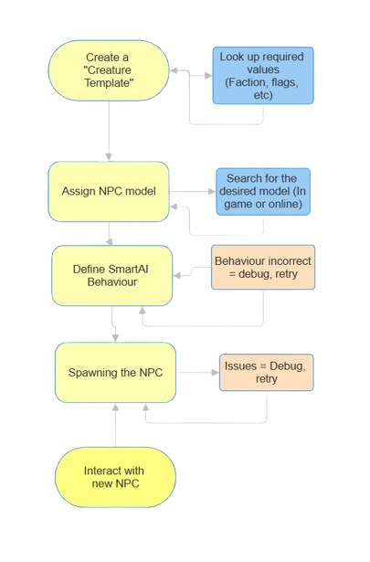

# Keira3 NPC Tutorial
[Install Keira3 here](https://www.azerothcore.org/Keira3/){:target="_blank"}

## Overview 
This guide walks through making a basic friendly NPC with Keira3, including assigning values, giving it a model, a gossip interaction, and spawning it in game  




## Before you begin... 
Ensure Keira3 is connected to the correct database. If you changed the database's port after initial setup, you may need to update it in the Keira3 login menu.  

Log out of Keira3 and log back in to ensure the connection is active every once and a while. If your database ever disconnects, Keira3 won't be able to push changes until you do.

## Creating a creature template 
  In this guide, only necessary fields will be used. Later, a cheatsheet will be provided for what each field actually means

1. Open the Creature dropdown menu, and click **Select Creature**

   &nbsp;  
1. Under "Create New" click "**Select**". You should be moved to the "Creature Template" tab.  
	  &bull; *The default number `9000000` is the unique ID for your creature. This will be how it's referred to in the database.*
 
     &nbsp;
1. Enter a name for your NPC  
	  &bull; *This will appear in game.*

    &nbsp;  
1. Click **IconName**, and scroll down to the chat bubble icon
	  &bull; *This will appear on mouseover.*
 
    &nbsp;  
1. Set both the minlevel and maxlevel to the level you wish your NPC to be

   &nbsp;  
1. Set "**Expansion**" to Wrath of the Lich King (Not entirely necessary, just most simple)

   &nbsp;  
1. Next to "**Faction**", press the "..." icon. In the "faction name" section, type your desired faction,  
   E.G Darnassus (`79`), or Orgrimmar (`29`)  
	  &bull; *Faction determines what the NPC is friendly or hostile to. 35 is the ID for a "friendly to all" NPC.*

   &nbsp;  
1. Open the "**npcflag**" menu, and enable `GOSSIP`, so the NPC can be interacted with. 

	  &bull; *Not necessary for non-interactable NPCs*

   &nbsp;  
1. Move to "**unit flags**". Enable `IMMUNE_TO_PC`, so no player characters can attack the NPC (Optional)

   &nbsp; 
1. Under **flags_extra**, enable the "civilian" flag, to reduce aggro range

   &nbsp; 
1. In behaviour, under **AIName**, select `SmartAI`  
	   &bull; *This will be used to make the NPC emote when you talk to it. We'll configure this later*

   &nbsp;
1. Set **gossip_menu_id** to `140`  
	  &bull; *This ID links to the basic "greetings" message*

   &nbsp;  
1. Scroll back up to the top and press "Execute"  
	  &bull; *You should get a success notification in the top right*

   &nbsp;
Now you have a custom creature template.  
Click the "creature template" tab on the left again, and a new array of menus will pop up,  dedicated to editing the "creature" you just created.


## Giving your NPC a model

Click on "Template Model"
The important field here is "**CreatureDisplayId**". It directly translates to an existing NPC model
The easiest way to get a specific model's ID is to find them in game

1. Click on an NPC, and use the command ```.npc info```. This will list everything about them, including displayid

   

2. Click "Add New Row" to add the displayid to your template
  
   The model should appear in the viewer at the bottom. Click Execute


## Using SmartAI to make the NPC use an emote when interacted with
This is simpler than it looks. For our purpose, most fields go unused

1. Click add row

### General tab

1. In "**Event**", scroll down to `64 - GOSSIP_HELLO`
  >This refers to when the "gossip" menu is opened

1. In "**Action**" select `5 - PLAY_EMOTE`

1. In "**Target**" select `1 - SELF`

### Action tab

This is where you can select which emote the NPC plays. 

(https://www.azerothcore.org/wiki/emotes)

There is a list of EmoteIds here. Pick one.

Click Execute


## GUID and spawning your NPC

What is a GUID? Every spawned creature has a unique GUID, that is assigned to each instance of it. A creature won't spawn if it has the same GUID as another  
At the bottom of all of the Keira3 menus, there is an "unused GUIDs" finder. Click "Search" and copy one

1. Move to the "Spawn" tab

2. Add new row, paste the GUID

3. In game, type the `.gps` command while you're standing exactly where you want your NPC. This will give you the information for mapid, zoneid, areaid, positions, and orientation.


### Notes
- Make sure you don't have any NPC selected when using the command, as it will give you their position instead of yours
- Use X, Y, and Z, **not** ZoneX, ZoneY, or Ground Z
- If the yellow is hard to read, you can right click "General" > Settings > Other and change the colour of "System Messages"    

4. Click Execute  
 
5. Restart your worldserver

The process is complete, and you now have a new friendly NPC to populate the world


 
